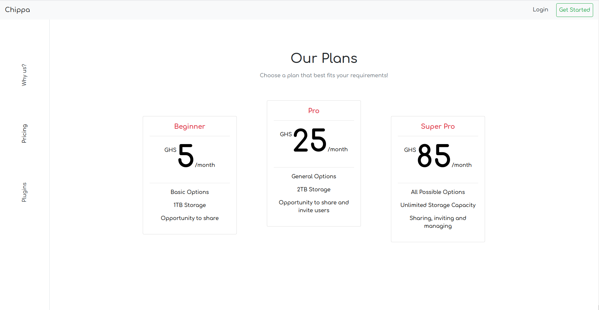

# Chippa


Chippa is a Single Page App built with [Vue Js](https://vuejs.org). It mimics an API call to display available subscription plans, and displays a payment form if any of the plan is clicked.
If further mimics an attempt to process the payment request and displays success message if all goes well.

This design was inspired by [Pricing](https://dribbble.com/shots/5380513-Pricing) by [Veronika Lkv](https://dribbble.com/v_inmotion).
## Built With
HTML  
Bootstrap 4.4  
VueJs  
Axios  
Mirage JS
## Project setup
```
npm install
```

### Compiles and hot-reloads for development
```
npm run serve
```

### Compiles and minifies for production
```
npm run build
```

### Lints and fixes files
```
npm run lint
```

### Customize configuration
See [Configuration Reference](https://cli.vuejs.org/config/).

## Authors

👤 **Solomon Appier-Sign**

- Github: [@githubhandle](https://github.com/appiersign)
- Twitter: [@appiersign](https://twitter.com/appiersign)
- Linkedin: [Solomon Appier-Sign](https://www.linkedin.com/in/solomon-appier-sign/)

## Contributing

This project is for educational purposes only, suggestions are accepted, but no contributions.

## Show Your Support

Kindly give me a star if you like this project

